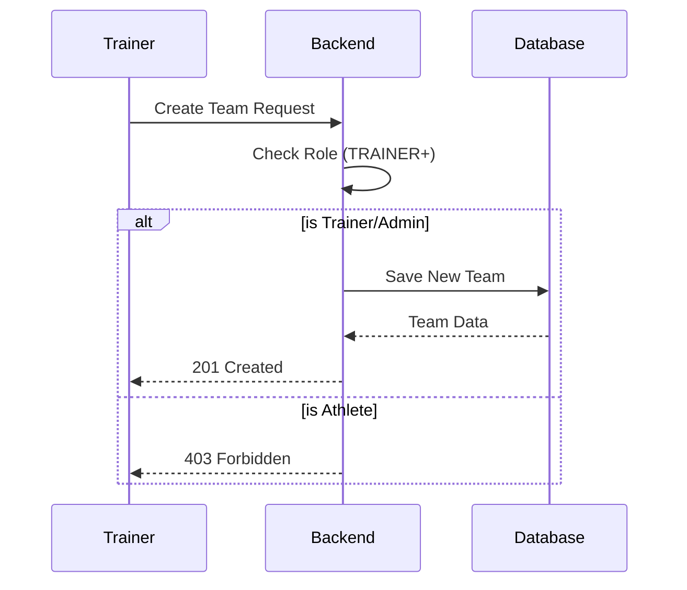
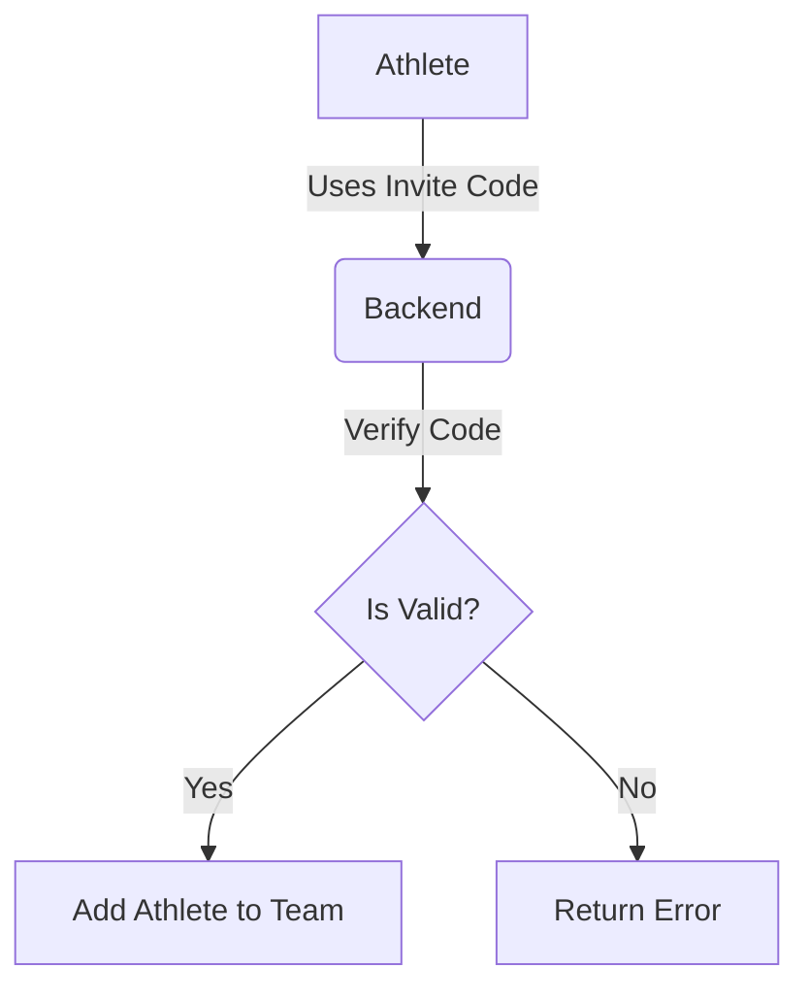

# User Roles and Permissions

This document describes the Role-Based Access Control (RBAC) system in the project.

## User Roles

| Role | Description |
| :--- | :--- |
| **ATHLETE** | A regular user who can track their own workouts, participate in team events, and view their progress. |
| **TRAINER** | A user who can create and manage teams, add athletes to teams, and create team events. |
| **ORGANIZATION_ADMIN** | A user who manages an entire organization, including multiple teams and trainers. |
| **SUPER_ADMIN** | System administrator with full access to all resources. |

## Permission Matrix

| Feature | ATHLETE | TRAINER | ORG_ADMIN | SUPER_ADMIN |
| :--- | :---: | :---: | :---: | :---: |
| View own profile | ✅ | ✅ | ✅ | ✅ |
| Track own exercises | ✅ | ✅ | ✅ | ✅ |
| View team members | ✅ | ✅ | ✅ | ✅ |
| Create a team | ❌ | ✅ | ✅ | ✅ |
| Edit/Delete team | ❌ | ✅ (Owner) | ✅ | ✅ |
| Add/Remove members | ❌ | ✅ | ✅ | ✅ |
| Create team events | ❌ | ✅ | ✅ | ✅ |
| Manage organization | ❌ | ❌ | ✅ | ✅ |

## Interaction Flows

### Team Creation and Management

### Joining a Team

